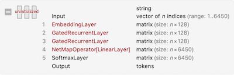
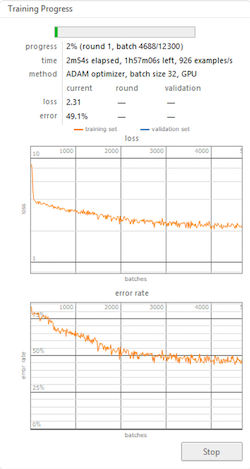

# Code Embeddings for Wolfram Language

## Introduction

Will programs ever be able to write other programs? This question is a discussion point where the halting problem is a significant argument against it. But could we already use machine learning techniques to simplify the daily routine of programmers? We think, yes.

### Problem

The problem of applying the machine learning algorithms such as neural networks to the source code is that the source code is not a numerical thing. We need to map the programming code to real numbers. Such a transformation is called an embedding.

### Code Embeddings

How should this transformation look like? For example, we can split the code into pieces and apply one-hot encoding where each element of a vector is associated with exactly one element. But would it be effective? The source code of programs is not random data, it's a sequence of commands with some structure, and an embedding must utilise the structure of the code as much as possible.

### What is this project about

In our project, we tried to explore different forms of embeddings for Wolfram Language. And then, use this representation to find similar built-in functions. For this purpose, we gathered a lot of samples of code in Wolfram Language from different sources. Then we cleaned the samples and made them interpretable. We trained a couple of classical neural network architectures with various parameters to find vector representation for built-in functions in Wolfram Language. Also, we did experiments with a state-of-the-art method in source code embeddings. The details are explained in the following .

All sources are available on GitHub: [https://github.com/ckorikov/WSS-19](https://github.com/ckorikov/WSS-19).


## Dataset

The success of machine learning tasks depends heavily on the quality of the data. There was no ready dataset for this task. We started collecting by ourselves. To build a dataset we used tree sources:

- all the Wolfram Mathematica documentation,
- the Mathematica's internal unencrypted files
- and 923 GitHub repositories as large as ~57Gb.

### File-based cache

Processing sources is a long-running process that is why we needed to have a mechanism which could recover data if the procedure is interrupted. The following code shows our implementation of the file-based cache. We used the Wolfram exchange format as a file format to serialize every piece of data.

```Mathematica
SetAttributes[keyValueStore, HoldRest];
keyValueStore[expr_, default_:None] := With[
	{path = FileNameJoin[{$cachePath, IntegerString[Hash[expr], 36] <> ".wxf"}]},
	Replace[
		Quiet @ Import[path, "WXF"],
		_?FailureQ :> With[
			{evaluated = default}, 
			Export[path, evaluated, "WXF"];
			evaluated
		]
	]
];
```

### Source I. Wolfram Mathematica documentation

Wolfram Mathematica provides a convenient way to access documentation data with help of `WolframLanguageData` function. It is known that the documentation contains a lot of samples of usage of built-in functions. We wanted to get these examples. Not providing whole code we just show the key points of the solution. 

Apply function `getSourceFromDocExample` to every element of data

```Mathematica
getSourceFromDocExample [ EntityValue[WolframLanguageData[symbol],"DocumentationExampleInputs"]]
```

where `symbol` is the name of requested documentation of the symbol.  In `getSourceFromDocExample` we extract data from `input` cells and transform them into expressions as follows

```Mathematica
Cell[BoxData[r_], "Input", ___] :> MakeExpression[r, StandardForm]
```

### Source II. Internal unencrypted files

We searched Wolfram Mathematica system files in the `$InstallationDirectory` directory. 

```Mathematica
wlFiles=FileNames["*.wl",$InstallationDirectory,Infinity];
mFiles=FileNames["*.m",$InstallationDirectory,Infinity];
```

Then we excluded inappropriate files like files from `AutoCompletionData` directory or `SearchIndex` manually. After this, we extracted expressions from every file. The main logic is in the following code where `path` is a full file path.

```Mathematica
List @@ Map[
			HoldComplete, 
			Replace[
			    Quiet@ToExpression[
				    StringReplace[
					    ReadString[path],
						{
							Shortest["Package["~~___~~"]"]-> ""
						}], InputForm, HoldComplete], {
							h_HoldComplete :> DeleteCases[h, Null],
							_ :> HoldComplete[]
						}
					]
				]
```
Here, the replacement 
```Mathematica
"Package["~~___~~"]"]-> ""
```
is needed to overcome incorrect behaviour of `ToExpression` function. 

### Source III. GitHub repositories

Data from GitHub repositories were downloaded with the help of the GitHub API. We tried to get all repositories which were written in Wolfram Language. GitHub sets mark "Mathematica" for such repositories. Also, we restricted ourselves with a timeout to avoid download repositories with colossal size. Finally, we got 923 GitHub repositories as large as ~57Gb. After cleaning auxiliary files and we got only 317 Mb of *.m files. We used the script for Wolfram Mathematica system files to extract expressions from the repositories.

After merging we have a dataset containing 464 991 valid Wolfram Mathematica expressions in `HoldComplete` form. In the dataset, column "source" shows either file path for system files and GitHub repositories, either function name for data from the official documentation. The "index" represents a position of the expression inside the corresponding source.


*To sum up, as the first step in the project, we gathered a dataset of code in Wolfram Language from three different sources. We came across several problems. Firstly, it is a continuation of the data gathering after fail which is solved with the file-based cache. Secondly, the code in Wolfram Language cannot be just loaded into Wolfram Mathematica because the system always tries to evaluate expressions, so we had to wrap every piece of our processing logic with `HoldComplete`. Thirdly, there was found a bug in `ToExpression` related to the processing of Wolfram Language packages, which we solved with ad-hoc exclusions manually. An example of the dataset is shown below.*

## Models

According to modern research, source code can be mapped in vector space with different granularity. For instance, It can be applied a linguistic approach to code when it is considered as a text. In this case, the character level granularity is used. But for source code, it is simpler to use token level granularity. Also, a source code representation should capture the structure of the program as much as possible. Next picture shows tree structure of the expression `a^3 + b c^2`.


### Language modelling

For simplicity, we started from a tokenwise splitting of Wolfram Language expressions to apply to then the statistical language modelling. This task implies to develop a probabilistic model that is able to predict the next token in the sequence given the tokens that precede it.

This is a classical machine learning task we used the following recurrent neural network architecture with two Gated Recurrent Unit (GRU).


We were doing experiments with different parameters of the network and finally chose the presented version. Here, we added dropout to increase the generalisability of the model.

On the following image, the wrapper of the network is shown.


We used basic options of Wolfram Mathematica neural network trainer to train the network.


Using t-SME we got the following embedding space:


*To summarise, we used a well-known task of language modelling to extract the semantic similarity of built-in Wolfram Language functions. Here, we trained an RNN with two GRU layers and dropout to predict the next symbol in the sequence of expression tokens. The timetable allowed us to perform only three pieces of neural network training with different parameters. As a result, we got an embedding vector space where the distance between the vector representing Wolfram Language functions and special symbols corresponds to the semantic distance of them.*

### code2vec

Another approach was suggested in the article "code2vec: learning distributed representations of code" [1]. The authors use a method-level granularity. According to their work, every method is represented as a bag of paths between terminal nodes in an abstract syntax tree. The formal explanation of the method can be found in the original article. If we apply this encoding to train network predicting names of methods it can be used to predict the name for methods based on the structure of them.

In this section, we implemented this encoding for Wolfram Language expressions. In addition to the originally suggested paths, we consider from paths from the root to terminal nodes to be able to encode expressions with less than two terminal nodes. An example of paths is presented below.


Later, we realised that we do not have enough data and time to train this model so we postpone it for future research.


*To try the state-of-the-art approach, we used code2vec which is presented in the article[1]. During Wolfram Summer School we implemented encoder which builds a paths-based representation of a  Wolfram Language expression. Training an attentional neural network and exploration of the results is a topic of future works.*

## Conclusions

In our project, we tried to explore different forms of embeddings for Wolfram Language. For this purpose, we:

- gathered a lot of samples of code in Wolfram Language
- cleaned the samples and made them interpretable
- trained a couple of classical neural network architectures
- did experiments with a state-of-the-art method in source code embeddings
- got images of embedding vector space in 2D.

## Future work

During the project, we built a pipeline to start exploring embedding for Wolfram Language. There are loads of open questions about optimal neural network architecture and parameters which can be studied in the future. Also, there are other several approaches based on machine learning successfully applied to different program languages [2], which could be implemented for the language. Finally,  it is interesting to find how to use the symbolic structure of Wolfram Language to represent programs expressively for machine learning.

1. Alon, U., Zilberstein, M., Levy, O. & Yahav, E. code2vec: learning distributed representations of code. Proc. ACM Program. Lang. 3, 1–29 (2019).
2. Chen, Z. & Monperrus, M. A Literature Study of Embeddings on Source Code. ArXiv190403061 Cs Stat (2019). 
