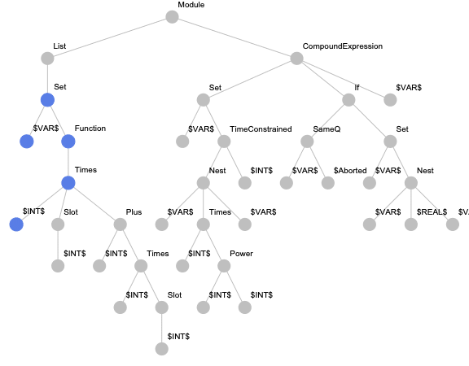

# Code Embeddings for Wolfram Language

## Introduction

Will programs ever be able to write other programs? This question is a discussion point where the halting problem is a significant argument against it. But could we already use machine learning techniques to simplify the daily routine of programmers? We think, yes.

### Problem

The problem of applying the machine learning algorithms such as neural networks to the source code is that the source code is not a numerical thing. We need to map the programming code to real numbers. Such a transformation is called an embedding.

### Code Embeddings

How should this transformation look like? For example, we can split the code into pieces and apply one-hot encoding where each element of a vector is associated with exactly one element. But would it be effective? The source code of programs is not random data, it's a sequence of commands with some structure, and an embedding must utilise the structure of the code as much as possible.

### What is this project about

In our project, we tried to explore different forms of embeddings for Wolfram Language. And then, use this representation to find similar built-in functions. For this purpose, we gathered a lot of samples of code in Wolfram Language from different sources. Then we cleaned the samples and made them interpretable. We trained a couple of classical neural network architectures with various parameters to find vector representation for built-in functions in Wolfram Language. Also, we did experiments with a state-of-the-art method in source code embeddings. The details are explained in the following .

All sources are available on GitHub: [https://github.com/ckorikov/WSS-19](https://github.com/ckorikov/WSS-19).


## Dataset

The success of machine learning tasks depends heavily on the quality of the data. There was no ready dataset for this task. We started collecting by ourselves. To build a dataset we used tree sources:

- all the Wolfram Mathematica documentation,
- the Mathematica's internal unencrypted files
- and 923 GitHub repositories as large as ~57Gb.

### File-based cache

Processing sources is a long-running process that is why we needed to have a mechanism which could recover data if the procedure is interrupted. The following code shows our implementation of the file-based cache. We used the Wolfram exchange format as a file format to serialize every piece of data.

```Mathematica
SetAttributes[keyValueStore, HoldRest];
keyValueStore[expr_, default_:None] := With[
	{path = FileNameJoin[{$cachePath, IntegerString[Hash[expr], 36] <> ".wxf"}]},
	Replace[
		Quiet @ Import[path, "WXF"],
		_?FailureQ :> With[
			{evaluated = default}, 
			Export[path, evaluated, "WXF"];
			evaluated
		]
	]
];
```

### Source I. Wolfram Mathematica documentation

Wolfram Mathematica provides a convenient way to access documentation data with help of `WolframLanguageData` function. It is known that the documentation contains a lot of samples of usage of built-in functions. We wanted to get these examples. Not providing whole code we just show the key points of the solution. 

Apply function `getSourceFromDocExample` to every element of data

```Mathematica
getSourceFromDocExample [ EntityValue[WolframLanguageData[symbol],"DocumentationExampleInputs"]]
```

where `symbol` is the name of requested documentation of the symbol.  Then we extract data from `input` cells and transform them into expression as follows

```Mathematica
Cell[BoxData[r_], "Input", ___] :> MakeExpression[r, StandardForm]
```

### Source II. Internal unencrypted files

### Source III. GitHub repositories

*To sum up, as the first step in the project, we gathered a dataset of code in Wolfram Language from three different sources. We came across several problems. Firstly, it is a continuation of the data gathering after fail which is solved with the file-based cache. Secondly, the code in Wolfram Language cannot be just loaded into Wolfram Mathematica because the system always tries to evaluate expressions, so we had to wrap every piece of our processing logic with `HoldComplete`. Thirdly, there was found a bug in `ToExpression` related to the processing of Wolfram Language packages, which we solved with ad-hoc exclusions manually. An example of the dataset is shown below.*


## Language modelling

### RNN

TBD

### Dropout

TBD

### TSNE

TBD

*To summarise, we used a well-known task of language modelling to extract the semantic similarity of built-in Wolfram Language functions. Here, we trained an RNN with two GRU layers and dropout to predict the next symbol in the sequence of expression tokens. The timetable allowed us to perform only three pieces of neural network training with different parameters. As a result, we got an embedding vector space where the distance between the vector representing Wolfram Language functions and special symbols corresponds to the semantic distance of them.*

## code2vec

TBD



*To try the state-of-the-art approach, we used code2vec which is presented in the following article. During Wolfram Summer School we implemented encoder which builds a paths-based representation of a  Wolfram Language expression. Training an attentional neural network and exploration of the results is a topic of future works.*

## Conclusions

In our project, we tried to explore different forms of embeddings for Wolfram Language. For this purpose, we:

- gathered a lot of samples of code in Wolfram Language
- cleaned the samples and made them interpretable
- trained a couple of classical neural network architectures
- did experiments with a state-of-the-art method in source code embeddings
- got images of embedding vector space in 2D.

## Future work

During the project, we built a pipeline to start exploring embedding for Wolfram Language. There are loads of open questions about optimal neural network architecture and parameters which can be studied in the future. Also, there are other several approaches based on machine learning successfully applied to different program languages [1], which could be implemented for the language. Finally,  it is interesting to find how to use the symbolic structure of Wolfram Language to represent programs expressively for machine learning.

1. Chen, Z. & Monperrus, M. A Literature Study of Embeddings on Source Code. ArXiv190403061 Cs Stat (2019). 
